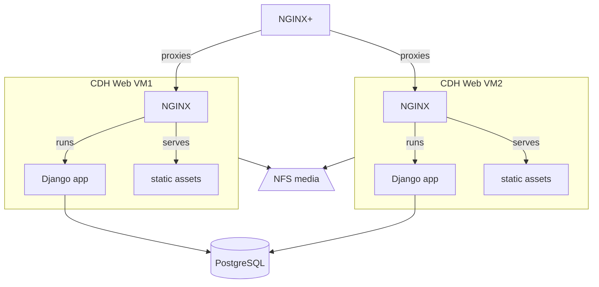

# CDH Web

CDH Web (`cdh-web`) is the homepage of the Center for Digital Humanities at Princeton, built as a Python/Django web application.

- Production site: https://cdh.princeton.edu/
- Software: https://github.com/Princeton-CDH/cdh-web/

The public site is accessed through the PUL load balancer (NGINX+).

There are two VMs for each environment (production, staging) running in parallel with the same application code. The load balancer routes traffic between the two VMs; redundancy allows for one host to be taken down for maintenance without taking the site down.

Both instances of the application connect to the same PostgreSQL database. User-uploaded media is stored on a shared NFS drive accessible to both machines.

## Deployment environments and default branches

| Environment | Hosts | Default branch |
|-------------|-------|----------------|
| Staging | cdh-test-web1.princeton.edu, cdh-test-web2.princeton.edu | `develop` |
| Production | cdh-web1.princeton.edu, cdh-web2.princeton.edu | `main` |

## Deploying via Ansible Tower

The recommended way to deploy CDH Web is through the [Ansible Tower web interface](https://ansible-tower.princeton.edu/#/home). No command-line access or local setup is required. The steps below are based on the [Deployment Guide](../deployment-guide.md), which also covers command-line deployment if needed.

**⚠️ Note:** We don't deploy to production on Friday afternoons.

### Step-by-step: deploy to staging

1. Go to [https://ansible-tower.princeton.edu/](https://ansible-tower.princeton.edu/) and sign in using **Sign in with SAML Campus SSO** (the small person-head icon).
2. In the left sidebar, navigate to **Resources** → **Templates**.
3. Search for **CDH Web** and click on the template name (not the rocket icon) to open the template page.
4. Click the **Launch** button. A multi-step wizard will appear:
   - **Credentials** page: click **Next** (no changes needed).
   - **Other prompts** page: click **Next** (no changes needed).
   - **Survey** page: select **staging** as the environment. The branch defaults to **develop** — leave it as-is unless you want to deploy a specific branch (see below).
   - **Preview** page: review your selections and click **Launch**.
5. The job output will appear. A full deployment typically takes several minutes. Watch for any red task failures in the output.

### Step-by-step: deploy to production

Follow the same steps as staging, but on the **Survey** page select **production** as the environment. The branch defaults to **main**.

### Deploying a non-default branch

On the **Survey** page, change the branch field from the default (`develop` or `main`) to your target branch name, tag, or commit hash. This is useful for deploying a release candidate or a feature branch to staging before it is merged.

Examples of valid values: `release/3.15`, `feature/my-branch`, `v4.2.1`

## Related playbooks

- `cdhweb` — deploys the CDH Web application to staging or production.
- `replicate` — copies production data and media to staging.
- `revert_deploy` — rolls back to the previous deployment by swapping symlinks. Does **not** reverse Django migrations.

## Other details

Load balancer proxy configuration is managed in [PUL princeton_ansible](https://github.com/pulibrary/princeton_ansible):

- [production config](https://github.com/pulibrary/princeton_ansible/blob/main/roles/nginxplus/files/conf/http/cdh_prod_web.conf)

Media files are stored on NFS at `/mnt/nfs/cdh/cdhweb/media/` and are shared between both VMs in each environment. They are **not** replaced or modified during a normal deployment.

GitHub deployment status is tracked automatically by the playbook — each run creates and closes a [GitHub deployment](https://github.com/Princeton-CDH/cdh-web/deployments) so there is a record of what was deployed and when.
