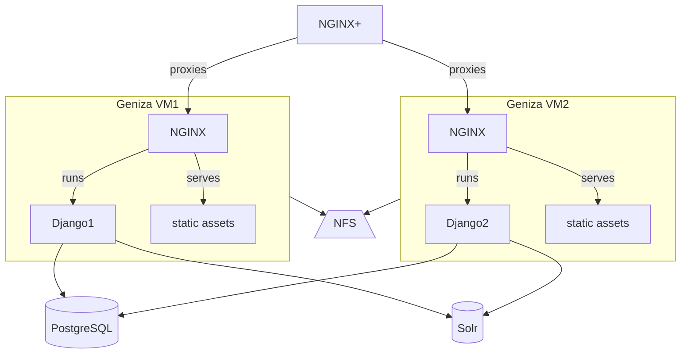

# Princeton Geniza Project 

Princeton Geniza Project (PGP or Geniza for short) is a custom
Python/Django web application. Version 4.0-4.x developed by CDH.

Production site: https://geniza.princeton.edu/en/
software: https://github.com/Princeton-CDH/geniza/

The site is accessed through the PUL load balancer, NGINX+. 

There are two VMs for each environment (production, staging) running in
parallel with the same content and application code. The load balancer
routes traffic between the two VMs; redundancy allows for one host to
be taken down for maintenance without taking the site down.  Both
instances of the application connect to the same PostgreSQL database and Solr
collection. User-uploaded content is stored on a shared NFS drive
accessible to both machines.

## Related playbooks

- The Geniza application can be deployed to staging or production with
  the `geniza` playbook.
- Production data can be replicated to staging with the `replicate`
  playbook (does not currently include Solr data; requires reindexing
  after replicate)