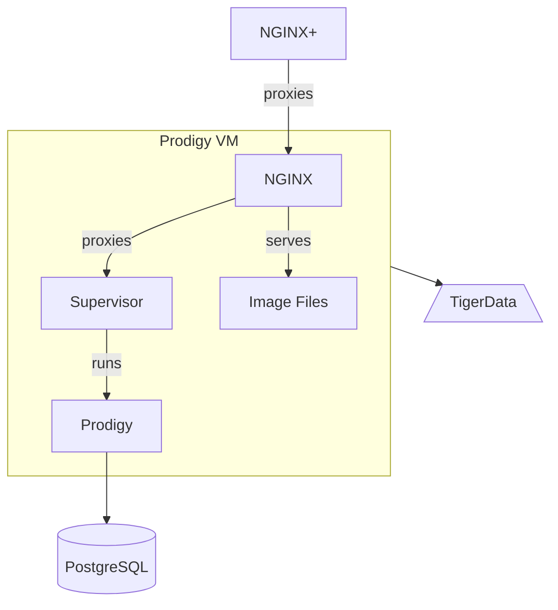

# Prodigy

The playbooks and hosts for Prodigy are setup to install a purchased copy of
[Prodigy](https://prodi.gy/) for annotation.

Prodigy is written in Python but it cannot be run directly in NGINX with Passenger,
so we use `supervisord` to run it and then proxy with NGINX. We also configure
NGINX to serve out page images for display in a custom image and text Prodigy
annotation recipe.

## Logging
Prodigy logs can be found within `/var/log/supervisor` on the machine running the Prodigy instance of interest.
