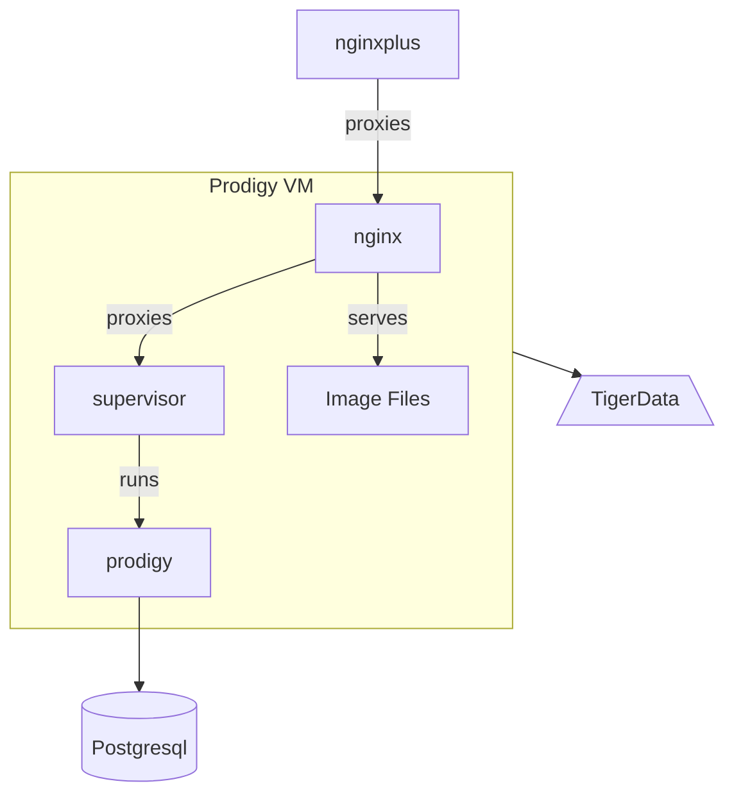

# Prodigy

The playboks and hosts for Prodigy are setup to install a purchased copy of
[prodigy](https://prodi.gy/) for annotation.

Prodigy is written in python but it cannot be run directly in nginx with passenger, 
so we use supervisord to run it and then proxy with nginx. We also configure
nginx to serve out page images for display in a custom image and text prodigy 
annotation recipe.

