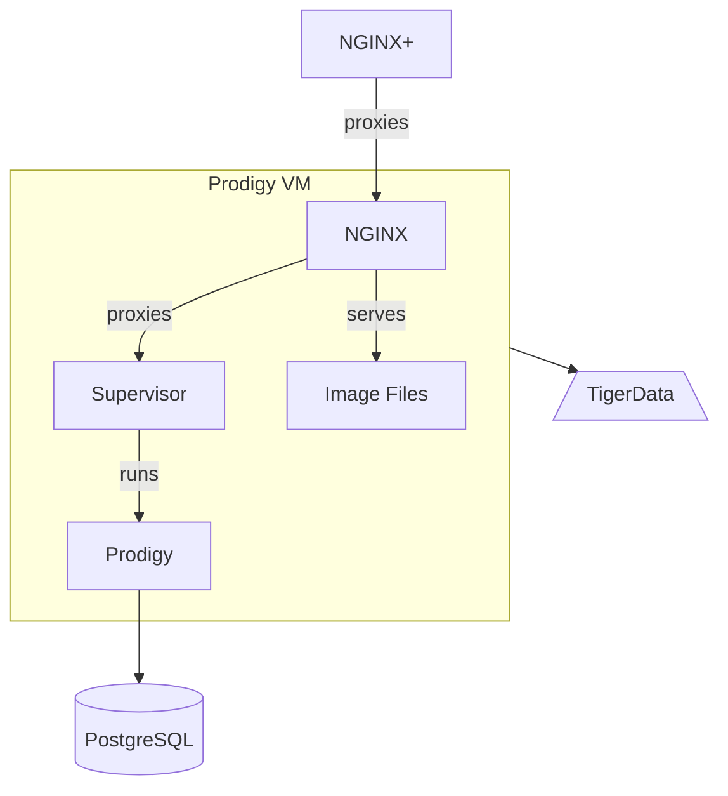

# Prodigy

The playbooks and hosts for Prodigy are setup to install a purchased copy of
[Prodigy](https://prodi.gy/) for annotation.

Prodigy is written in Python but it cannot be run directly in NGINX with Passenger,
so we use `supervisord` to run it and then proxy with NGINX. Optionally, we can 
also configure NGINX to serve out page images for display in a custom image and text Prodigy
annotation recipe.


```mermaid
flowchart TD
    nginxplus[NGINX+ ] -- proxies --> nginx
    subgraph prodigyvm [Prodigy VM]
     nginx[NGINX] -- proxies --> Supervisor
     Supervisor -- runs --> Prodigy
     nginx -- serves --> images[Image Files]
    end
    prodigyvm --> tigerdata[/TigerData\]
    Prodigy --> db[(PostgreSQL)]
```

## Load Balancing (NGINX+)

Like other CDH applications, Prodigy has two VMs for each environment (i.e., production, staging).
Unlike the others, Prodigy's load balancer is configured to serve only one of these VMs (`cdh-prodigy1`, `test-cdh-prodigy1`). The second VM was disabled due to task routing issues.

The NGINX+ configuration files can be found in PUL's [`princeton_ansible`](https://github.com/pulibrary/princeton_ansible).
There is a separate file for each environment.
Production's is [`cdh_prod_prodigy.conf`](https://github.com/pulibrary/princeton_ansible/blob/main/roles/nginxplus/files/conf/http/cdh_prod_prodigy.conf) and staging's is [`cdh_test_prodigy.conf`](https://github.com/pulibrary/princeton_ansible/blob/main/roles/nginxplus/files/conf/http/dev/cdh_test_prodigy.conf).

NOTE: Setting session names in advance (by setting `PRODIGY_ALLOWED_SESSIONS`) may resolve the need for this workaround. In the future, we should investigate this further.

## Logging

Prodigy logs can be found within `/var/log/supervisor` on the machine running the Prodigy instance of interest.

## MuSE

Currently, the Prodigy playbook is set up for the MuSE concept annotation task. This app does not serve images and limits the use of TigerData to copying over data files during setup.

### Prodigy Setup Role

#### Directory and file creation

- Creates a MuSE data (`muse/data`) and recipe directory (`muse/recipes`) if they don't already exist
- The Prodigy annotation recipe file is downloaded from the URL specified by the `prodigy_recipe_url` and saved to the path specified by `prodigy_recipe_pyfile`
- Optionally, a command recipe file can be downloaded from the URL specified by the `prodigy_commands_url`
- Copies the Prodigy input task data from TigerData at the path specified by `prodigy_datafile_src` and copied locally to `prodigy_datafile`
- Copies the Prodigy instructions file from TigerData at the path specified by `prodigy_instruct_src` and copied locally to `prodigy_instruct`
- Creates a `requirements.txt` for Python requirements (copied from `cdh-ansible/roles/prodigy_setup/files/requirements.txt`)
- Creates the Prodigy config file `prodigy.json` which is a combination of options specified in the default `prodigy_config_options` and the `prodigy_config_extra_options` group variable

#### Python Requirements
Currently, the only requirement is `psycopg2binary`. The [`muse`](https://github.com/Princeton-CDH/muse/) package is not installed directly to avoid dependency conflicts with `prodigy`.

### Prodigy App Configuration
#### Data files
Currently, the playbook copies two datafiles from TigerData.

1. Prodigy input task data (JSONL): This is a JSONL file containing the annotation task examples that are served by the app for annotation. The current file is generated by the [`build_notion_concept_tasks.py`](https://github.com/Princeton-CDH/muse/blob/develop/src/muse/annotation/build_notion_concept_tasks.py) program.
2. Prodigy instructions (TXT/HTML): This is a simple TXT or HTML file whose contents are displayed in a dialog box when the help icon is selected within the web app.

The local paths for these files are specified by the group variables `prodigy_datafile` and `prodigy_instruct` respectively.
The TigerData source paths for these files are specified by the group variables `prodigy_datafile_src` and `prodigy_instruct_src` respectively.

#### Vault Variables

- The required `PRODIGY_ALLOWED_SESSIONS` environment variable is specified in the `vault.yml`.

### Deploying

Since the playbook uses the NGINX role from PUL's [`princeton_ansible`](https://github.com/pulibrary/princeton_ansible), it cannot currently be deployed via Ansible Tower. This is a temporary issue that will be resolved once a new execution environment is created.

Before running a playbook, the Ansible Galaxy dependencies must be installed.
```
uv run ansible-galaxy install -r requirements.yml
```

Then the playbook can be run as normal.
